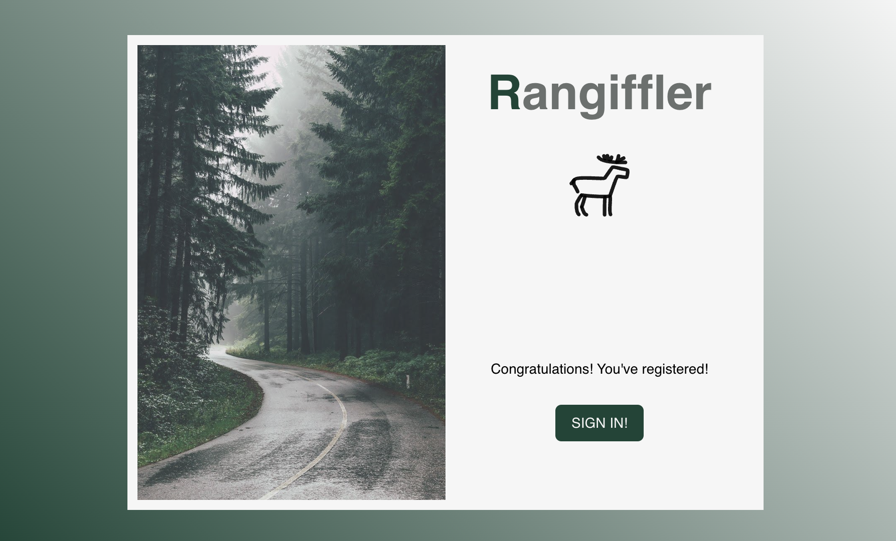
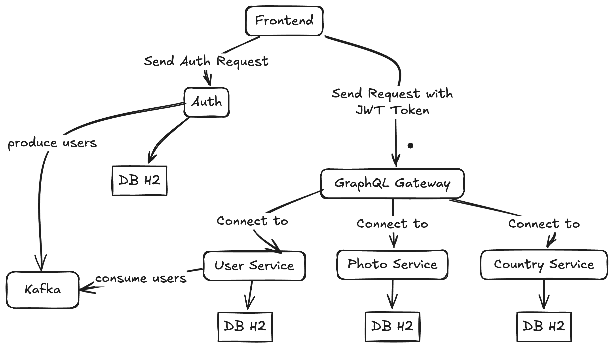
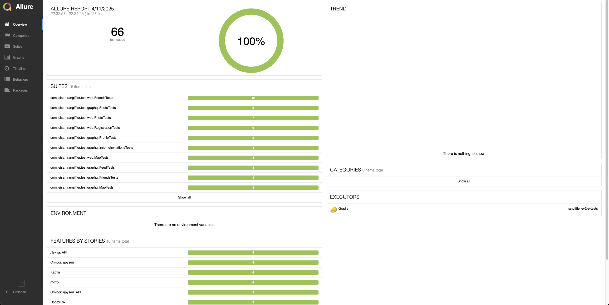

# 📘 Rangiffler Project

## 🧩 Описание


Rangiffler — это платформа для тех, кто вдохновляется путешествиями. Здесь можно создавать собственную карту воспоминаний, делиться историями, знакомиться с людьми, близкими по духу, и сохранять особенные моменты через фотографии.

**Rangiffler** — это микросервисное приложение с архитектурой GraphQL Federation. Состоит из следующих компонентов:

- **GraphQL Gateway** — Apollo Router.
- **Subgraphs (Micronaut + GraphQL):**
  - `country-service` — управляет странами.
  - `user-service` — управляет пользователями.
  - `photo-service` — управляет фотографиями.
- **Auth-сервис (Spring Security)** — регистрация, логин и токены.
- **Frontend** — клиентское приложение(TS, React).
- Взаимодействие между микросервисами через **REST API**.
- Каждому микросервису соответствует **встроенная база данных H2**.

## 📦 Требования к окружению

Для установки и запуска проекта необходимо установить:
- **Docker** (https://www.docker.com/)
- **Docker Compose**
- **Java 21** (JDK)
- JDK 21 JAVA_HOME
- **Node.js и npm** (https://nodejs.org/)
- **allure** Для отчетов allure

## 📦 Порты

- 9000 - auth
- 4000 - gateway
- 80 - frontend
- 9092, 9093 - kafka
- 8085 - kafka-ui

## 🚀 Запуск проекта

```bash
#!/bin/bash
./gradlew :rangiffler-graphql-common:build :rangiffler-photo-service:build :rangiffler-user-service:build :rangiffler-country-service:build :rangiffler-auth:build
docker compose build
docker compose up
```
Или же запустить файл run.sh
```bash
./run.sh
```
Если старая версия docker-compose
```bash
#!/bin/bash
./gradlew :rangiffler-graphql-common:build :rangiffler-photo-service:build :rangiffler-user-service:build :rangiffler-country-service:build :rangiffler-auth:build
docker-compose build
docker-compose up
```

- Gateway будет доступен на: [http://localhost:4000/graphql](http://localhost:4000/graphql)
- frontend часть [http://localhost](http://localhost)
- auth:login, register pages  [http://localhost:9000](http://localhost:9000)
- kafka-ui  [http://localhost:8085](http://localhost:8085)

После успешного выполнения ./run.sh проект запустит все сервисы, и будет доступен по адресу [http://localhost](http://localhost)
Важно после выполнения скрипта посмотреть все ли контейнеры запущены, если какой-то упал - перезапусти команду, или же контейнер.

## 🧱 Архитектура



## 🛠️ Стек технологий

- **GraphQL Gateway:** Apollo Router
- **Subgraphs:** Micronaut GraphQL
- **Auth Service:** Spring Boot + Spring Security
- **Database:** H2 (in-memory)
- **Frontend:** TS, react
- **Docker & Docker Compose** для контейнеризации

## 📂 Структура проекта

```
rangiffler-project/
├── rangiffler-auth/
├── rangiffler-country-service/
├── rangiffler-user-service/
├── rangiffler-photo-service/
├── rangiffler-graphql-common/
├── rangiffler-gql-client/
├── rangiffler-e-2-e-tests/
├── rangiffler-gateway/
├── docker-compose.yaml
└── ...
```

## 🚀 Запуск тестов
Тесты запускать только после запуска проекта
```bash
#!/bin/bash
./gradlew :rangiffler-e-2-e-tests:build
cd rangiffler-e-2-e-tests
allure generate build/allure-results --clean -o build/allure-report
allure open build/allure-report
```
или через файл
```bash
./run-e2e-tests.sh
```
Тестовое покрытие

Так же имеются unit тесты
